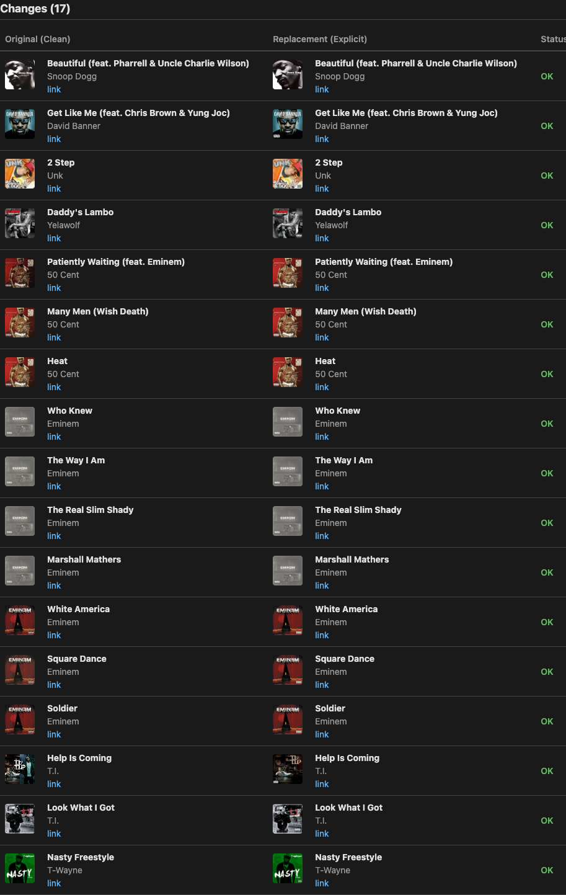
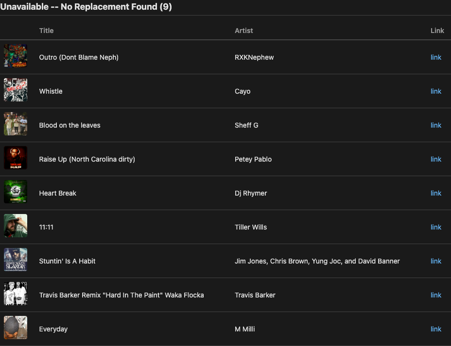
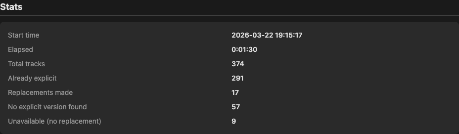

# uncensored

> Upgrade your playlist. No edits.

A Python CLI tool that scans a YouTube Music playlist and replaces clean/edited songs with explicit versions, and finds working replacements for unavailable tracks.

## Requirements

- Python 3.9+
- [uv](https://docs.astral.sh/uv/) (package manager)
- A YouTube Music account (Premium not required)

## Installation

```bash
git clone git@github.com:ttlequals0/uncensored.git
cd uncensored
uv sync
```

## Authentication Setup

One-time setup using your browser's logged-in session:

1. Open [YouTube Music](https://music.youtube.com) in your browser and log in
2. Open Developer Tools (F12) and go to the **Network** tab
3. Find any POST request to `music.youtube.com`
4. Copy the request headers:
   - **Firefox:** Right-click the request -> Copy Value -> Copy Request Headers
   - **Chrome:** Click the request -> Headers tab -> select all header text and copy
5. Paste into a text file (e.g. `headers.txt`) and save
6. Run setup and enter the path to your file:

```bash
uv run uncensored --setup
```

The tool reads the headers file, extracts the auth cookies, and saves them to `browser.json` (gitignored). No Google Cloud project needed.

## Finding Your Playlist ID

Open the playlist in YouTube Music and copy the value of the `list=` parameter from the URL:

```
https://music.youtube.com/playlist?list=PLxxxxxxxxxxxxxxxx
```

The playlist ID is `PLxxxxxxxxxxxxxxxx`.

## Usage

```bash
# Audit only -- see what would change without modifying anything
uv run uncensored PLxxxxxxx --dry-run

# Interactive replacement -- confirm each swap
uv run uncensored PLxxxxxxx

# Auto-accept all changes
uv run uncensored PLxxxxxxx --yes

# Create a copy instead of editing in-place
uv run uncensored PLxxxxxxx --copy

# Copy with a custom name
uv run uncensored PLxxxxxxx --copy --copy-name "My Explicit Playlist"

# Replace unavailable tracks with YouTube video versions
uv run uncensored PLxxxxxxx --yt-video

# Custom report output path
uv run uncensored PLxxxxxxx --output report.html

# Enable debug logging
uv run uncensored PLxxxxxxx --verbose
```

## Sample Output

### Scanning

```
$ uv run uncensored PLxxxxxxx
Scanning playlist: PLxxxxxxx

  [1/374] Searching: Snoop Dogg - Beautiful (feat. Pharrell & Uncle Charlie Wilson)
  [2/374] Searching: OFWGKTA - Tyler, The Creator - WHAT THE FUCK RIGHT NOW
  [3/374] Already explicit: Tyler, The Creator - Domo23
  [4/374] Already explicit: Tyler, The Creator - Trashwang
  ...
  [41/374] Unavailable: RXKNephew - Outro (Dont Blame Neph)
  ...
  [374/374] Already explicit: Slim Thug - Thug

Scan complete. Found 18 explicit replacements across 374 songs.
9 unavailable track(s) could not be replaced.
```

### Interactive Confirmation

```
Explicit replacements:

#1 of 18
┏━━━━━━━━┳━━━━━━━━━━━━━━━━━━━━━━━━━━━━━━━━━┳━━━━━━━━━━━━━━━━━━━━━━━━━━━━━━━━━┓
┃        ┃ Current (Clean)                 ┃ Replacement                     ┃
┡━━━━━━━━╇━━━━━━━━━━━━━━━━━━━━━━━━━━━━━━━━━╇━━━━━━━━━━━━━━━━━━━━━━━━━━━━━━━━━┩
│ Title  │ Beautiful (feat. Pharrell &     │ Beautiful (feat. Pharrell &     │
│        │ Uncle Charlie Wilson)           │ Uncle Charlie Wilson)           │
│ Artist │ Snoop Dogg                      │ Snoop Dogg                      │
│ Link   │ music.youtube.com/watch?v=...  │ music.youtube.com/watch?v=...  │
└────────┴─────────────────────────────────┴─────────────────────────────────┘
 [y] Yes  [n] No  [a] Accept All  [q] Quit: y

#2 of 18
...
```

### Result

```
Applying replacements...

18 replacement(s) applied.

Report saved to: uncensored_report_20260322_192231.html
```

## How It Works

### Explicit matching

For each non-explicit track in your playlist:

1. Searches YouTube Music for `"{title} {artist}"` with clean-version suffixes stripped (e.g. "(Clean)", "[Edited]", "(Radio Edit)")
2. Filters results to only explicit tracks by the same artist
3. Checks that the duration is within 10 seconds of the original (filters out remixes and live versions)
4. Picks the closest duration match

If no match is found and the track title contains ` - ` (common for user-uploaded YouTube videos like `"Meek Mill ft. Red Cafe - I'm Killin Em"`), the tool parses the real artist and song name from the title, strips featuring tags and producer credits, and searches again.

### Unavailable tracks

Tracks marked as unavailable by YouTube Music (deleted, region-locked, etc.) are detected during the scan. The tool searches for any available version of the song, preferring explicit versions when available. Unavailable tracks that can't be matched are listed separately in the report.

### In-place replacement (default)

When run without `--copy`, replacements happen directly in the original playlist:

1. The explicit version is added to the playlist
2. It is moved to the same position as the original track
3. The original clean/unavailable track is removed

Playlist order is preserved.

### Copy mode (`--copy`)

Creates a new playlist with all tracks from the original, but with clean tracks swapped for their explicit versions. The original playlist is not modified. Duplicate tracks are preserved in the copy.

If you don't own the playlist, the tool detects the permission error on the first replacement attempt and automatically falls back to copy mode.

## Known Limitations

- Songs that were never released with an explicit version appear in the "not found" section of the report
- User-uploaded YouTube videos work best when the title follows an `"Artist - Song"` pattern. Titles without that format (e.g. just a song name with a channel as the artist) may not match
- `ytmusicapi` is an unofficial, reverse-engineered library -- it may break if YouTube Music changes their web client
- The Liked Music playlist does not support track removal (the tool auto-switches to copy mode)
- Tracks missing a `setVideoId` from the API cannot be removed from playlists
- Browser auth headers expire periodically -- re-run `--setup` if you get auth errors

## Report

Every run generates a self-contained HTML report that auto-opens in your browser. Supports automatic light/dark theme.

### Header


### Changes

Side-by-side comparison of every clean-to-explicit swap, with thumbnails and status.



### Unavailable Tracks

Tracks that are no longer available on YouTube Music and could not be replaced.



### Stats


