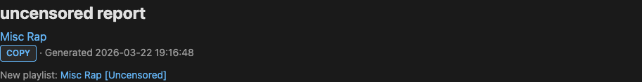
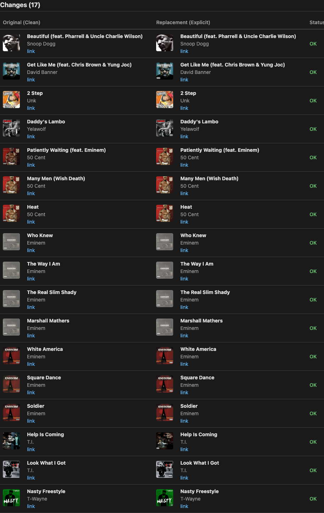
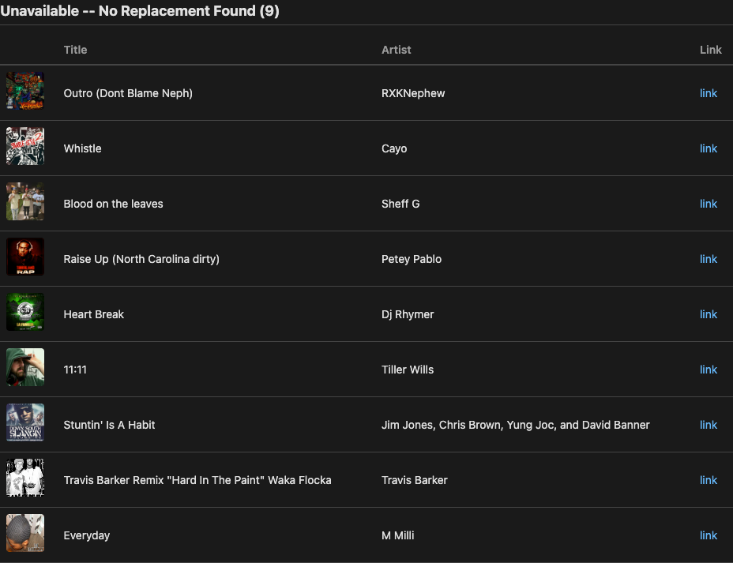
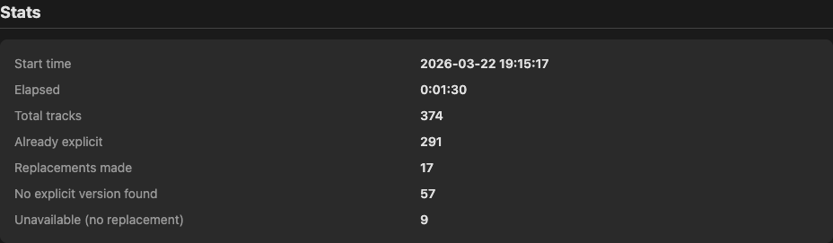

# uncensored

> Upgrade your playlist. No edits.

A Python CLI tool that scans a YouTube Music playlist and replaces clean/edited songs with explicit versions, finds working replacements for unavailable tracks, and removes duplicate songs.

## Requirements

- Python 3.10+
- [uv](https://docs.astral.sh/uv/) (package manager)
- A YouTube Music account (Premium not required)

## Installation

```bash
git clone git@github.com:ttlequals0/uncensored.git
cd uncensored
uv sync
```

## Authentication Setup

One-time setup using your browser's logged-in session:

1. Open [YouTube Music](https://music.youtube.com) in your browser and log in
2. Open Developer Tools (F12) and go to the **Network** tab
3. Find any POST request to `music.youtube.com`
4. Copy the request headers:
   - **Firefox:** Right-click the request -> Copy Value -> Copy Request Headers
   - **Chrome:** Click the request -> Headers tab -> select all header text and copy
5. Paste into a text file (e.g. `headers.txt`) and save
6. Run setup and enter the path to your file:

```bash
uv run uncensored --setup
```

The tool reads the headers file, extracts the auth cookies, and saves them to `browser.json` (gitignored). Copied headers that break replayed requests (the request line, `content-encoding`, `connection` and similar) are dropped automatically, and an existing `browser.json` is cleaned the same way when it is loaded. No Google Cloud project needed.

## Finding Your Playlist ID

Open the playlist in YouTube Music and copy the value of the `list=` parameter from the URL:

```
https://music.youtube.com/playlist?list=PLxxxxxxxxxxxxxxxx
```

The playlist ID is `PLxxxxxxxxxxxxxxxx`.

## Usage

```bash
# Audit only -- see what would change without modifying anything
uv run uncensored PLxxxxxxx --dry-run

# Interactive replacement -- confirm each swap
uv run uncensored PLxxxxxxx

# Auto-accept all changes
uv run uncensored PLxxxxxxx --yes

# Create a copy instead of editing in-place
uv run uncensored PLxxxxxxx --copy

# Copy with a custom name
uv run uncensored PLxxxxxxx --copy --copy-name "My Explicit Playlist"

# Replace unavailable tracks with YouTube video versions
uv run uncensored PLxxxxxxx --yt-video

# Preserve the original track's playlist position (flips playlist to Manual sort)
uv run uncensored PLxxxxxxx --preserve-position

# Find and remove duplicate songs (standalone, no explicit scan)
uv run uncensored PLxxxxxxx --dedupe

# Audit duplicates without removing anything
uv run uncensored PLxxxxxxx --dedupe --dry-run

# Custom report output path (must be inside the current directory)
uv run uncensored PLxxxxxxx --output report.html

# Use credentials from a different file (default: ./browser.json)
uv run uncensored PLxxxxxxx --auth other-account.json

# Enable debug logging
uv run uncensored PLxxxxxxx --verbose
```

## Sample Output

### Scanning

```
$ uv run uncensored PLxxxxxxx
Scanning playlist: PLxxxxxxx

  [1/374] Searching: Snoop Dogg - Beautiful (feat. Pharrell & Uncle Charlie Wilson)
  [2/374] Searching: OFWGKTA - Tyler, The Creator - WHAT THE FUCK RIGHT NOW
  [3/374] Already explicit: Tyler, The Creator - Domo23
  [4/374] Already explicit: Tyler, The Creator - Trashwang
  ...
  [41/374] Unavailable: RXKNephew - Outro (Dont Blame Neph)
  ...
  [374/374] Already explicit: Slim Thug - Thug

Scan complete. Found 18 explicit replacements across 374 songs.
9 unavailable track(s) could not be replaced.
```

### Interactive Confirmation

```
Explicit replacements:

#1 of 18
Current
┌────────┬───────────────────────────────────────────────────┐
│ Title  │ Beautiful (feat. Pharrell & Uncle Charlie Wilson) │
│ Artist │ Snoop Dogg                                        │
│ Link   │ https://music.youtube.com/watch?v=...&list=PLxxx  │
└────────┴───────────────────────────────────────────────────┘
Replacement
┌────────┬───────────────────────────────────────────────────┐
│ Title  │ Beautiful (feat. Pharrell & Uncle Charlie Wilson) │
│ Artist │ Snoop Dogg                                        │
│ Link   │ https://music.youtube.com/watch?v=...             │
└────────┴───────────────────────────────────────────────────┘
[y] Yes  [n] No  [a] Accept All  [q] Quit: y

#2 of 18
...
```

### Result

```
Applying replacements...

18 replacement(s) applied.

Report saved to: uncensored_report_20260322_192231.html
```

## How It Works

### Explicit matching

For each non-explicit track in your playlist:

1. Searches YouTube Music for `"{title} {artist}"` with clean-version suffixes stripped (e.g. "(Clean)", "[Edited]", "(Radio Edit)")
2. Filters results to only explicit tracks by the same artist
3. Checks that the duration is within 10 seconds of the original (filters out remixes and live versions)
4. Picks the closest duration match

If no match is found and the track title contains ` - ` (common for user-uploaded YouTube videos like `"Meek Mill ft. Red Cafe - I'm Killin Em"`), the tool parses the real artist and song name from the title, strips featuring tags and producer credits, and searches again.

### Unavailable tracks

Tracks marked as unavailable by YouTube Music (deleted, region-locked, etc.) are detected during the scan. The tool searches for any available version of the song, preferring explicit versions when available. Unavailable tracks that can't be matched are listed separately in the report.

### In-place replacement (default)

When run without `--copy`, replacements happen directly in the original playlist:

1. The explicit version is added to the playlist (appended)
2. The original clean/unavailable track is removed

By default, replacements are NOT reordered into the original track's slot. This avoids flipping the playlist's server-side sort to Manual, so "Recently added" remains the default sort in the YouTube Music UI and new songs added later continue to appear where you expect them.

Pass `--preserve-position` to restore the old behavior: the replacement is moved to the original's slot (via YouTube Music's reorder API). This flips the playlist's default sort to Manual for all future viewers.

### Copy mode (`--copy`)

Creates a new playlist with all tracks from the original, but with clean tracks swapped for their explicit versions. The original playlist is not modified. Duplicate tracks are preserved in the copy.

If you don't own the playlist, the tool detects it up front (no entries expose a `setVideoId`, which YouTube Music only serves for playlists you can edit) and switches to copy mode automatically. If removing an original is refused later (403/unauthorized), it builds a copy with every confirmed swap instead. Dry runs switch too, so the report previews what the copy would contain. Because nothing has to be removed from the original, copy mode also upgrades tracks that have no `setVideoId`.

If a track cannot be added to the new playlist even after a one-by-one retry, the console says so and the report lists it.

### Dedupe mode (`--dedupe`)

Standalone pass that finds duplicate songs in the playlist and removes extra copies. It replaces the normal explicit-replacement scan for that run.

Two entries are duplicates when they are the same upload (identical video id) or share a normalized title + primary artist key with durations within 10 seconds of each other. Normalizing ignores case, emoji, and clean/edited or featuring suffixes, and keeps letters in any script, so non-Latin titles are compared as written. Clean/explicit/radio-edit variants group together; live or remix versions with different lengths or suffixed titles stay separate.

For each group the tool keeps the best copy and removes the rest:

1. Available over unavailable
2. Official YouTube Music track over user-uploaded YouTube video
3. Explicit over clean
4. Earliest playlist position breaks ties

Each group is confirmed interactively (y/n/a/q) before anything is removed. `--dry-run` reports without removing; `--copy` builds a new playlist without the extra copies; `--yes` skips every confirmation and removes all detected duplicates, so use it with care. Unowned playlists and Liked Music fall back to copy mode automatically; the copy drops every confirmed duplicate by playlist position, including copies that lack a `setVideoId` and could never be removed in-place.

## Known Limitations

- Songs that were never released with an explicit version appear in the "not found" section of the report
- User-uploaded YouTube videos work best when the title follows an `"Artist - Song"` pattern. Titles without that format (e.g. just a song name with a channel as the artist) may not match
- `ytmusicapi` is an unofficial, reverse-engineered library -- it may break if YouTube Music changes their web client
- The Liked Music playlist does not support track removal (the tool auto-switches to copy mode)
- Tracks missing a `setVideoId` from the API cannot be removed from playlists, so in-place runs skip them. Unavailable tracks are the exception: their replacement is added and the original stays (reported as a duplicate warning). Copy mode can replace or drop either kind in the new playlist
- Playlists you don't own expose no `setVideoId` at all; the tool switches to copy mode automatically
- Browser auth headers expire periodically -- re-run `--setup` if you get auth errors
- Dedupe groups need a known duration to pair different uploads of the same song; two copies of the same song with different video ids are not merged if either reports an unknown duration. Identical video ids always merge regardless of duration
- Dedupe matching is exact-title based: the same song titled differently across copies (e.g. a misspelling in a user upload) will not group
- Replacement tracks always get a fresh `dateAdded` timestamp -- YouTube Music does not expose any API to preserve the original track's `dateAdded`. When the playlist is sorted by "Recently added" in the UI, replaced tracks will cluster at the top of the list. Use `--copy` to start fresh with clean timestamps on a new playlist, at the cost of a new playlist URL

## Report

Every run generates a self-contained HTML report that auto-opens in your browser. Supports automatic light/dark theme.

### Header



### Changes

Side-by-side comparison of every clean-to-explicit swap, with thumbnails and status.



### Unavailable Tracks

Tracks that are no longer available on YouTube Music and could not be replaced.



### Duplicate Groups

`--dedupe` runs show each duplicate group with a verdict per copy: KEEP for the best version, then REMOVED, DROPPED IN COPY, TO REMOVE (dry run), NOT REMOVED (declined, or the run failed), NO SETVIDEOID (in-place runs that cannot touch that copy) or FAILED (removal rejected, with the error).

### Stats


